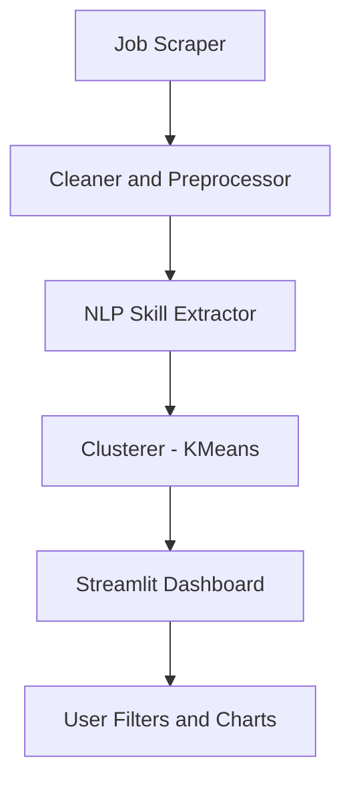
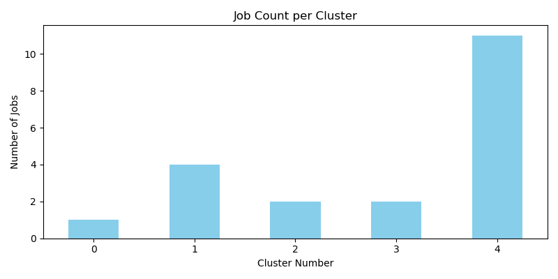

# 📊 Job Market Intelligence Dashboard

An intelligent, real-time dashboard that scrapes job listings, extracts trending skills, clusters similar roles, and visualizes insights using **Python**, **NLP**, and **Streamlit**.

---

## ✨ Key Features

- 🕵️ **Real-Time Job Scraping** – Extract listings from job sites using `requests`, `BeautifulSoup`, and `pandas`.
- 🧠 **NLP Skill Extraction** – Uses `regex`, `tokenization`, and keyword matching to extract trending skills from job descriptions.
- 📊 **Interactive Dashboard** – Built using `Streamlit` to visualize job trends, skill clouds, and role clusters.
- 🧩 **Job Clustering** – Groups roles using `TfidfVectorizer` and `KMeans` for industry-level grouping.
- 🔍 **Role & Skill Filters** – Enables filtering by location, skill keywords, and job clusters.
- 🔄 **Auto-Refresh Ready** – Designed to support weekly automation via GitHub Actions or cron jobs.

---

## 🚀 Quick Start

```bash
# Clone the repository
git clone https://github.com/raghava0071/job-market-intelligence-dashboard.git
cd job-market-intelligence-dashboard

# Create a virtual environment
python3 -m venv venv
source venv/bin/activate         # On Windows: venv\Scripts\activate

# Install required packages
pip install -r requirements.txt

# Launch the Streamlit dashboard
streamlit run app.py
```

---

## 💬 Sample Outputs

### 📂 Files Generated
- `raw_jobs.csv`
- `cleaned_jobs.csv`
- `clustered_jobs.csv`

### 🎯 NLP Results
- Top trending skills extracted from job descriptions
- Job titles grouped into meaningful clusters
- Visualized word clouds and skill frequency charts

### 📈 Dashboard Filters
- Job Role Cluster
- Location
- Skill Keyword

---

## 🧠 System Architecture



---

## 🔧 Tech Stack

- **Python** – Core programming and scripting
- **BeautifulSoup** – HTML parsing and web scraping
- **Pandas / NumPy** – Data wrangling and preprocessing
- **scikit-learn** – Machine learning (KMeans clustering)
- **Matplotlib / WordCloud** – Visualizations and skill clouds
- **Streamlit** – Interactive dashboard and user interface

---

## 📷 Visual Samples (To Be Added)

Add these screenshots under the `/images/` folder once available:

```markdown
[](https://github.com/raghava0071/job-market-intelligence-dashboard/blob/main/cluster_counts.png)


```

---

## 🎓 Ideal Use Cases

- 📘 Portfolio Projects for Data Science & Analytics
- 📈 Job Market Research and Skill Trends Monitoring
- 🎯 Entry-Level & OPT Candidates Showcasing Real Projects

---

## 🙌 Future Enhancements

- ✅ Automate weekly refresh via GitHub Actions or cron
- ✅ Add resume matching using cosine similarity
- ✅ Enable login & saved filter options
- ✅ Public deployment via Streamlit Cloud

---

## 🧑‍💻 Author

**Raghavendra Karanam**  
📍 Delray Beach, FL  
📧 raghavendrakaranam30@gmail.com  
🔗 [LinkedIn](https://linkedin.com/in/raghavendrakaranam) | [GitHub](https://github.com/raghava0071)

> This project is in active development. Contributions, feedback, and ideas are always welcome!
